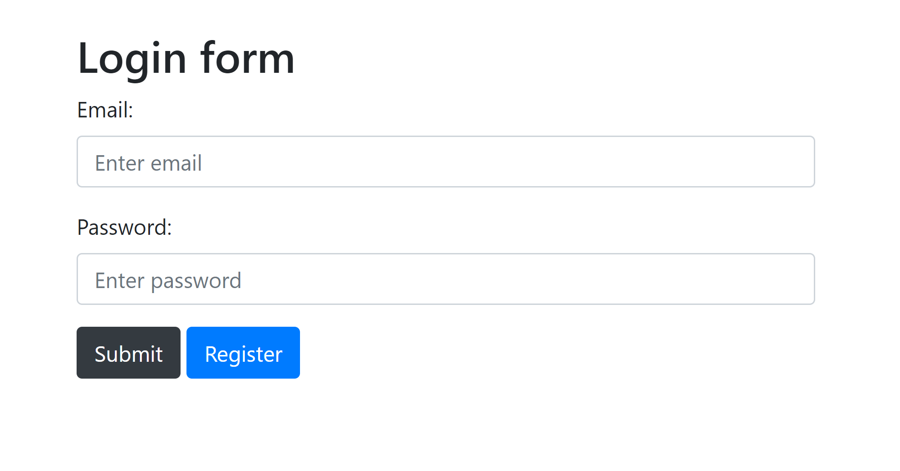
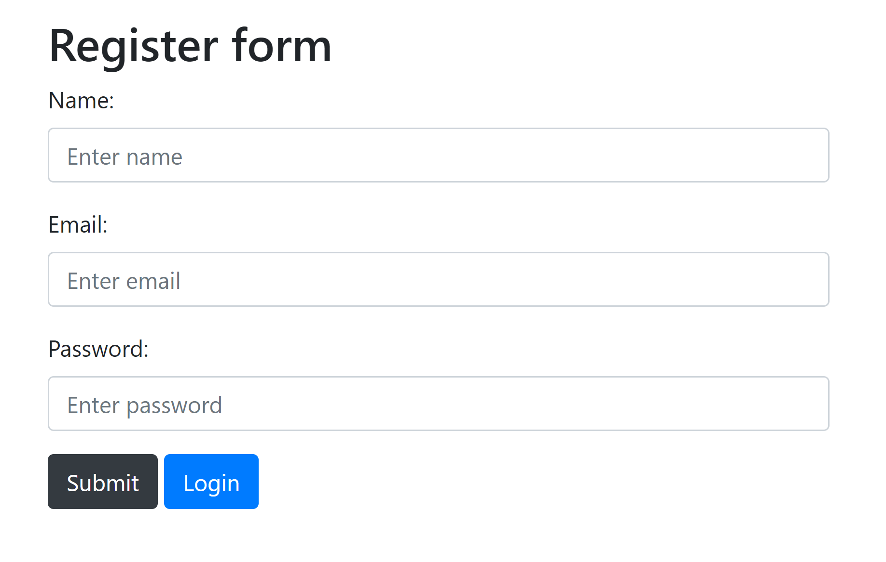
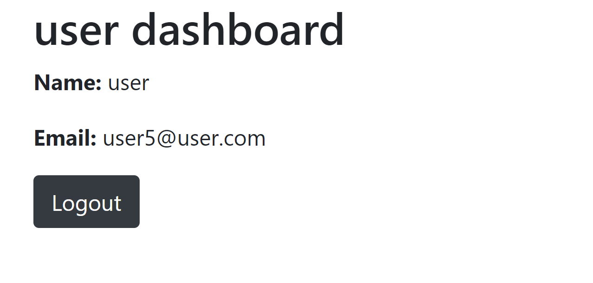

# Flask Authentication App (Login & Register)

A teaching resource for **T Level Digital Production, Design and Development (DPDD)** learners. It shows how to build a simple user authentication system in Flask: registering an account, logging in, viewing a protected dashboard and logging out.

The lesson slides are included: [`Final -lesson on login-register app.pptx`](Final%20-lesson%20on%20login-register%20app.pptx)

| Login | Register | Dashboard |
|---|---|---|
|  |  |  |

---

## What learners practise

- Routing and handling `GET` and `POST` requests in Flask
- Rendering HTML templates with Jinja2
- Storing users in an SQLite database with Flask-SQLAlchemy
- Hashing passwords with **bcrypt** instead of storing them as plain text
- Using sessions to keep a user logged in and protect a page

---

## Getting started

```bash
pip install -r requirements.txt
python app.py
```

Then open http://127.0.0.1:5000 in your browser. The database (`database.db`) is created automatically the first time the app runs.

---

## Project structure

| File | Purpose |
|---|---|
| `app.py` | Flask app: user model, routes and password checking |
| `templates/` | HTML pages: home, register, login and dashboard |
| `screenshots/` | Screenshots used in this README |
| `requirements.txt` | Python packages needed |

---

## Extension tasks

- Show a friendly message if someone registers with an email that is already in use
- Add password rules (minimum length, a number, a capital letter)
- Use Flask-WTF forms with CSRF protection
- Set the `SECRET_KEY` environment variable rather than relying on the built-in practice value

---

## Credits

Adapted for classroom use from [flask-authentication-system](https://github.com/kritimyantra/flask-authentication-system) by kritimyantra.

Lesson resource prepared by **Aniqa Arooj**, Digital Lecturer.
